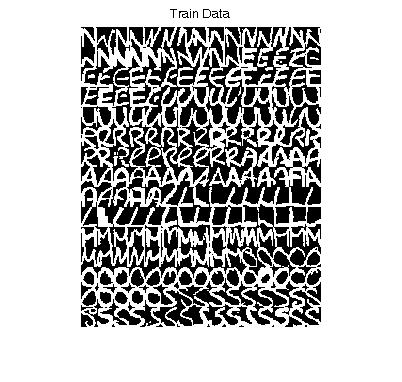
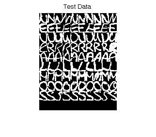
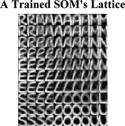
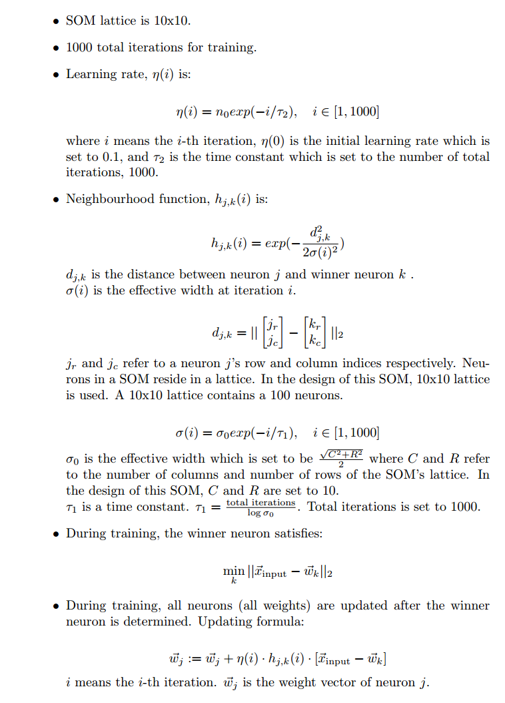

# Self-Organizing Map (SOM) #

## Introduction ##
This SOM classifies the handwritten characters 'N', 'E', 'U', 'R', 'A', 'L', 'S', 'O', and 'M' into a 10x10 lattice.  Handwritten characters are provided as 20x16 pixel images.  

This repository provides training data, test data, MATLAB codes for training a SOM, testing a SOM, and visualizing a SOM's lattice.

There are no additional/third-party/external dependencies. MATLAB's Neural Network toolbox is **not** required. MATLAB alone will suffice.

## Contents ##

- **SOM\_database.mat** contains the test and training data sets.

- **som\_wts\_1.mat** and **som\_labels\_1.mat** are the weights and neuron labels for an SOM I had trained using train\_SOM.m.

- **train\_SOM.m** trains an SOM. An SOM is trained with images from SOM\_database.mat by default.

- **test\_SOM.m** tests an SOM. My saved SOM is tested by default.

- **visualize\_SOM\_lattice.m** visualizes a SOM's lattice like in the picture above. My saved SOM's lattice is visualized by default.

- **visualize\_dataset.m** visualizes the images in SOM_database.mat like in the pictures above.

## Running ##

Run these .m files like how you would regular MATLAB .m files.  These .m files were developed on MATLAB R2012a except SOM_database.mat which was likely developed on an older version of MATLAB.

## Design Parameters ##

## Keywords ##
Self Organizing Map, Self-organizing Map, SOM, Self-organizing Feature Map, SOFM, Artificial Neural Network, ANN, unsupervised learning, Kohonen map, Kohonen network, handwriting recognition, MATLAB

## Acknowledgments ##

These codes were implemented in fulfilment of an assignment (EE5904R Neural Networks Homework #3) from the National University of Singapore (NUS).  I do not take credit for the creation of this assignment.  I wrote these codes, not the assignment.
